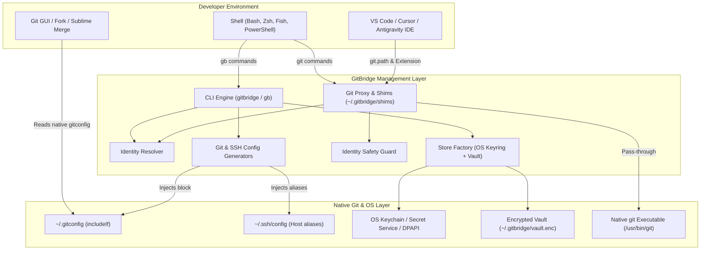
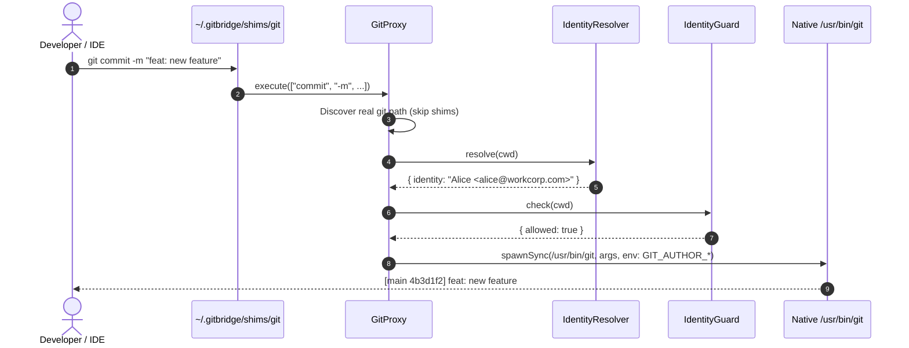

# GitBridge Deep Technical Architecture

This document provides a comprehensive deep dive into the inner workings, security mechanisms, data flows, and subsystem interactions of **GitBridge**.

---

## 1. System Architecture Overview

GitBridge sits between the developer's developer tools (Terminal, IDEs, Git GUIs) and the operating system's Git/SSH execution layer.



---

## 2. Core Subsystems

### 2.1 Configuration Store (`src/core/config/config-store.ts`)
- The single source of truth for all GitBridge persistence.
- Manages:
  - `config.json`: Global flags, directory routing rules, default identity ID.
  - `identities.json`: List of Git author profiles (`id`, `name`, `email`, `signingKey`, `isDefault`).
  - `accounts.json`: Git provider accounts (`providerId`, `host`, `username`, `authType`, `sshKeyPath`).
  - `repos.json`: Explicit repository-level profile overrides.
- Performs **atomic file writes** (`filepath.tmp.<timestamp> -> renameSync`) with `0o600` permissions to prevent file corruption.

### 2.2 Identity Resolution Engine (`src/core/identity/identity-resolver.ts`)
When any command runs (e.g. `gb ctx`, `git commit` via proxy, or extension status update), the resolver determines the identity according to this exact precedence:

1. **Explicit Repository Profile**: Checks `repos.json` matching `cwd` or `git rev-parse --show-toplevel`.
2. **Directory Rules (Longest-Prefix Match)**:
   - Scans all rules in `config.json`.
   - Resolves and expands tildes (`~`).
   - If multiple rules match a nested directory path, selects the rule with the longest path prefix.
3. **Global Default**: The identity marked `isDefault: true` or referenced by `defaultIdentityId`.
4. **System Git Fallback**: Reads `user.name` and `user.email` from the user's base git configuration.
5. **Mismatch Detection**: Flags `isMismatched: true` if the local repository git config specifies an author email that conflicts with the resolved rule.

### 2.3 Native Git Command Proxy (`src/core/git/git-proxy.ts` & `override-manager.ts`)
- When Native Git Override is active, `~/.gitbridge/shims/git` is prepended to the system `PATH`.
- When invoked:
  1. If called as `git bridge ...` or `git gb ...`, translates directly to GitBridge CLI commands.
  2. Parses arguments to locate the target directory (`-C <dir>`) and primary git subcommand (`commit`, `push`, `status`, etc.).
  3. Discovers the true underlying git binary (e.g. `/usr/bin/git`) while strictly ignoring shims to avoid recursion.
  4. For commit operations (`commit`, `merge`, `rebase`, `cherry-pick`, `am`), injects environment variables:
     - `GIT_AUTHOR_NAME`, `GIT_AUTHOR_EMAIL`
     - `GIT_COMMITTER_NAME`, `GIT_COMMITTER_EMAIL`
     - Evaluates `IdentityGuard` safety check.
  5. For network operations (`push`, `pull`, `fetch`, `clone`), injects:
     - `GIT_SSH_COMMAND="ssh -i <sshKeyPath> -o IdentitiesOnly=yes"` if account specifies an SSH key.
  6. Spawns the real Git binary with inherited stdio (`spawnSync`).



### 2.4 SSH Account Isolation & Host Aliasing (`src/core/ssh/`)
Git does not natively allow specifying different SSH private keys for different repositories hosted on the same domain (e.g. `github.com`). GitBridge solves this transparently:
1. Each authenticated account with an SSH key receives a generated SSH host alias:
   ```sshconfig
   Host github.com-work
       HostName github.com
       User git
       IdentityFile ~/.ssh/id_ed25519_work
       IdentitiesOnly yes
   ```
2. When directory rules map to that account, Git's `insteadOf` rewrites URLs automatically:
   ```gitconfig
   [url "git@github.com-work:"]
       insteadOf = git@github.com:
   ```
3. Clones and pushes to `git@github.com:org/repo.git` automatically use the work key without manual URL hacking.

### 2.5 Credential Storage Hierarchy (`src/core/storage/`)
- Implements `StoreFactory.getStore()`:
  - **Linux**: Freedesktop Secret Service API via `libsecret` / `secret-tool`.
  - **macOS**: Apple Keychain via `/usr/bin/security`.
  - **Windows**: Windows Credential Manager via DPAPI.
  - **Fallback / Headless**: `EncryptedVault` (`~/.gitbridge/vault.enc`), encrypted with AES-256-GCM using PBKDF2 (100,000 rounds) key derivation.
- Responds to standard Git credential helper queries:
  ```bash
  git credential fill
  # protocol=https
  # host=github.com
  ```

### 2.6 IDE Integration (`src/core/ide/ide-sync-manager.ts`)
- Automatically detects installed IDE configurations:
  - **Visual Studio Code**: `~/.config/Code/User/settings.json`
  - **VS Code Insiders**: `~/.config/Code - Insiders/User/settings.json`
  - **Cursor**: `~/.config/Cursor/User/settings.json`
  - **Antigravity IDE**: `~/.config/Antigravity/User/settings.json`
  - **VSCodium**: `~/.config/VSCodium/User/settings.json`
- Safely injects:
  - `git.path`: Pointing to `~/.gitbridge/shims/git`.
  - `terminal.integrated.env.<platform>.GITBRIDGE_OVERRIDE: "1"`.
- Cleanly restores previous settings when unsynced (`gb ide unsync`).
