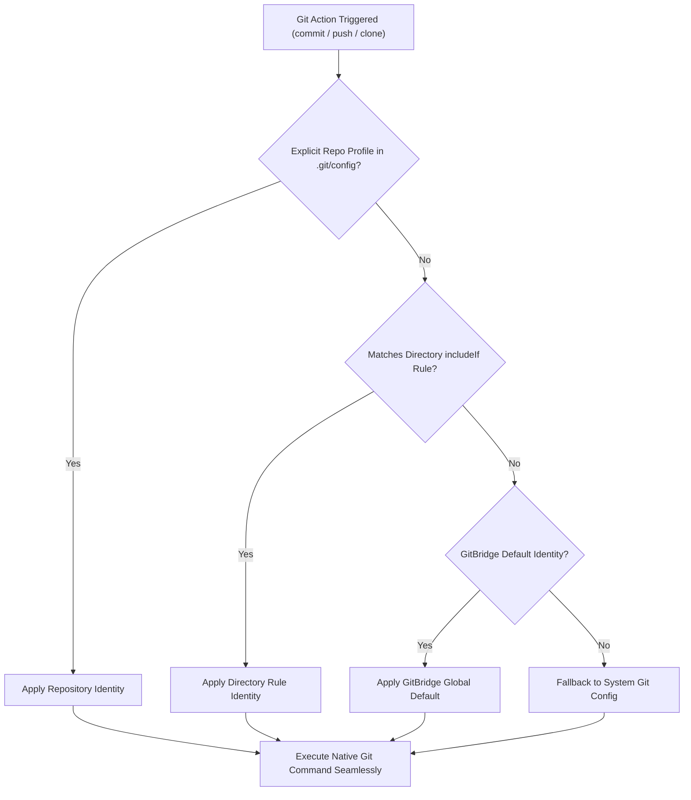

<div align="center">

<br />

# 🌉 `GitBridge`
### *Universal Git Identity, Multi-Account & Provider Management Layer*

<p align="center">
  <b>Seamlessly manage identities, provider accounts, and SSH keys across Git workflows without wrapping or replacing native Git.</b>
</p>

<p align="center">
  <a href="https://github.com/FuadTesfaye/gitbridge/actions"></a>
  <a href="https://www.typescriptlang.org/"></a>
  <a href="https://bun.sh/"></a>
  <a href="https://opensource.org/licenses/MIT"></a>
  <a href="./extension"></a>
</p>

<p align="center">
  <a href="#-quick-start"><b>⚡ Quick Start</b></a> •
  <a href="#-why-gitbridge"><b>💡 Why GitBridge?</b></a> •
  <a href="#-fast-command-matrix-gitbridge--gb"><b>⌨️ Fast Commands</b></a> •
  <a href="#-ide-extension-vs-code-cursor--antigravity"><b>🖥️ IDE Extension</b></a> •
  <a href="#-security-model--local-only-architecture"><b>🔒 Security</b></a>
</p>

<br />

```
                      Developer / IDE (VS Code, Cursor, Antigravity)
                                            │
                                 (Standard git commands)
                                            ▼
                                        Native Git
                                            │
                ┌───────────────────────────┼───────────────────────────┐
                │                           │                           │
       [includeIf / .gitconfig]    [credential.helper]           [~/.ssh/config]
                │                           │                           │
                ▼                           ▼                           ▼
        ┌───────────────┐           ┌───────────────┐           ┌───────────────┐
        │Identity Engine│           │Secure Keyring │           │SSH Host Router│
        │personal vswork│           │macOS/Linux/Win│           │github.com-work│
        └───────────────┘           └───────────────┘           └───────────────┘
```

</div>

---

## 💡 Why GitBridge?

| The Problem Without GitBridge ❌ | The Solution With GitBridge ⚡ |
|---|---|
| **Accidental Leaks**: Committing with your personal email in company repos or your corporate email in open-source projects. | **Automatic Context Routing**: Enter `~/Personal` and Git automatically signs as personal; enter `~/Projects/work` and it seamlessly switches identities via `includeIf`. |
| **SSH Collision Hell**: Pushing to multiple GitHub accounts fails or attempts the wrong SSH key. | **Isolated SSH Routing**: Generates discrete `Host github.com-<account>` aliases with `IdentitiesOnly yes` automatically. |
| **Plaintext Tokens**: Personal access tokens written in plaintext files or cleartext git configs. | **Hardware Keyring Integration**: Tokens are stored 100% locally in **Linux Secret Service**, **macOS Keychain**, or **Windows Credential Manager**. |
| **Bloated CLI Wrappers**: Tools that alias or intercept `git` add runtime latency and break editor tools. | **Native-First Architecture**: 0ms overhead. VS Code, Cursor, JetBrains, and terminal execute pure native Git. |

---

## ⚡ Quick Start

### 1. Global Installation
```bash
# Via Bun (Fastest)
bun add -g gitbridge

# Or via npm
npm install -g gitbridge
```

### 2. Run the 60-Second Setup Wizard
```bash
gb setup
```
The interactive setup will guide you through:
1. Configuring your **Personal** and **Work** identities.
2. Connecting your provider accounts (**GitHub Device Flow**, **GitLab**, or **Bitbucket**).
3. Defining workspace directory routing rules (e.g. `~/Projects/work/**` $\to$ `work`).
4. Activating Git and SSH integration points.

### 3. Verify Health & Connectivity
```bash
gb doc
```
Runs comprehensive diagnostics for your Git toolchain, OS keyring, SSH keys, and provider API reachability.

---

## ⌨️ Fast Command Matrix (`gitbridge` / `gb`)

GitBridge provides dual binaries (`gitbridge` and `gb`) with identical high-speed execution and short aliases:

| Category | Fast Command | Full Command | Action |
|---|---|---|---|
| 📊 **Overview** | `gb st` | `gitbridge status` | Display dashboard of identities, accounts, rules & status |
| 🔍 **Context** | `gb ctx` | `gitbridge context` | Inspect active identity and email mismatch warnings for current folder |
| 🔄 **Switch** | `gb sw [id]` | `gitbridge switch [id]` | Switch Git identity for the current repo (or `-g` for global default) |
| 🛠️ **Init** | `gb init` | `gitbridge init` | Initialize repository profile & pre-commit safety guard |
| 👤 **Identities** | `gb id ls` | `gitbridge identity list` | List all configured commit identities |
| | `gb id add` | `gitbridge identity add` | Create a new Git identity (interactive or with `--name`, `--email`) |
| | `gb id use <id>` | `gitbridge identity use <id>` | Set an identity as global default |
| | `gb id rm <id>` | `gitbridge identity remove <id>` | Remove an identity |
| 🐙 **Accounts** | `gb acc ls` | `gitbridge account list` | List authenticated Git provider accounts |
| | `gb acc rm <id>` | `gitbridge account remove <id>` | Remove account and wipe tokens from OS keyring |
| 🔑 **Auth** | `gb auth login` | `gitbridge auth login [prov]` | Authenticate with GitHub (Web Browser/PAT), GitLab, or Bitbucket |
| | `gb auth logout`| `gitbridge auth logout <prov>`| Revoke tokens and log out |
| 📁 **Rules** | `gb rules ls` | `gitbridge rule list` | List directory routing rules |
| | `gb rule add` | `gitbridge rule add [dir] [id]` | Map a workspace folder path to a Git identity |
| | `gb rule rm` | `gitbridge rule remove <id>` | Delete a directory routing rule |
| 🔗 **Remotes** | `gb rem ls` | `gitbridge remote list` | List remotes configured for current repository |
| | `gb rem add` | `gitbridge remote add <n> <u>` | Add remote with automatic SSH account host routing |
| 🚀 **Multi-Push** | `gb push --all` | `gitbridge push --all` | Push active branch to all configured remotes simultaneously |
| ⚙️ **Integrations**| `gb enable` | `gitbridge enable` | Safely inject GitBridge managed blocks into Git & SSH configs |
| | `gb disable` | `gitbridge disable` | Safely remove GitBridge blocks and restore original configs |
| 🩺 **Doctor** | `gb doc` | `gitbridge doctor` | Run full diagnostics (Git CLI, Keyring, SSH Keys, Provider APIs) |

---

## 🖥️ IDE Extension (VS Code, Cursor & Antigravity)

GitBridge includes a built-in extension in [`extension/`](./extension) compatible with **VS Code**, **Cursor**, **Windsurf**, and **Google Antigravity IDE**:

<div align="center">

```
┌────────────────────────────────────────────────────────────────────────────┐
│ Activity Bar  │ GitBridge Explorer (Sidebar)                               │
│ ───────────── │ ────────────────────────────────────────────────────────── │
│ 🌉 GitBridge  │ ▼ ACTIVE CONTEXT                                           │
│               │   📁 Repository: my-awesome-app                            │
│               │   👤 Identity: Fuad Tesfaye <personal@example.com>         │
│               │   🏷️  Source: Directory Rule (~/Personal)                   │
│               │   🐙 Account: @FuadTesfaye (GitHub)                        │
│               │   🔗 Remote: origin (git@github.com:...)                   │
│               │                                                            │
│               │ ▼ IDENTITIES                                           [+] │
│               │   ✔ personal (Fuad Tesfaye <personal@example.com>)         │
│               │   ○ work (Fuad Tesfaye <work@company.com>)                 │
│               │                                                            │
│               │ ▼ ACCOUNTS & PROVIDERS                                 [+] │
│               │   🐙 GitHub: @FuadTesfaye (OAuth Keyring)                  │
│               │   🦊 GitLab: @fuad_corp (PAT)                              │
│               │                                                            │
│               │ ▼ DIRECTORY RULES                                      [+] │
│               │   📁 ~/Personal ➔ personal                                 │
│               │   📁 ~/Projects/work ➔ work                                │
└────────────────────────────────────────────────────────────────────────────┘
┌────────────────────────────────────────────────────────────────────────────┐
│ Status Bar: [$(person) personal: Fuad Tesfaye] [$(github) @FuadTesfaye]    │
└────────────────────────────────────────────────────────────────────────────┘
```

</div>

### Extension Highlights:
- 👤 **Live Status Bar Widget**: Shows active identity badge and provider account at all times.
- 🔄 **Real-Time State Watcher**: Run `gb sw work` in your terminal and the IDE status bar and explorer update instantly without an editor reload.
- ⚠️ **Mismatch Warning**: Highlights mismatched `.git/config` emails before you commit.
- 🚀 **One-Click Multi-Push**: Trigger parallel pushes directly from the sidebar.

---

## 🔒 Security Model & Local-Only Architecture

GitBridge is engineered with a **zero-trust, local-only security architecture**:

- 🛡️ **100% Local Execution**: GitBridge operates exclusively on your local machine. It has **no telemetry, no tracking, and no external cloud servers**. Requests are made only directly to the Git providers you configure (GitHub, GitLab, Bitbucket).
- 🔑 **Hardware-Backed OS Keychains**: Access tokens and passwords are **never written to plain JSON files, logs, or git config files**. They are stored directly in your operating system's native secure keyring:
  - **Linux**: Linux Secret Service (`secret-tool` / libsecret / DBus Session Keyring).
  - **macOS**: Apple Keychain Services (`/usr/bin/security` backed by Secure Enclave).
  - **Windows**: Windows Credential Manager (DPAPI-encrypted).
- 🔐 **Air-Gapped / Headless Fallback**: In environments without a graphical keychain daemon (e.g. CI containers), credentials are encrypted in `~/.gitbridge/vault.enc` using **AES-256-GCM** with a **PBKDF2** machine-unique derivation key (100,000 rounds of SHA-256 with cryptographically random salt and 12-byte IV).
- 📁 **Restricted POSIX Permissions**: All configuration and generated files enforce strict permission modes:
  - `~/.gitbridge/` directory: `0700` (`rwx------`, owner only)
  - Config, key & vault files: `0600` (`rw-------`, owner only)
- 🗝️ **SSH Key Isolation**: Dedicated `Host <host>-<account_id>` blocks enforce `IdentitiesOnly yes`, ensuring the SSH agent only presents the specific key mapped to that account—preventing cross-account identity leaks.

---

## 🏗️ Identity Resolution Precedence

When Git or GitBridge resolves an identity for any directory:

$$\text{Local Repository Profile} \succ \text{Directory Rule (includeIf)} \succ \text{Global Default Identity} \succ \text{System Git Config}$$



---

## 🧪 Testing & Verification

GitBridge is verified with a comprehensive automated test suite covering unit schemas, credential stores, injectors, URL parsers, and full Git lifecycle integrations:

```bash
# Run all 37 unit & integration tests
bun test

# Run strict TypeScript typechecks
bun run typecheck
```

---

## 📄 License

MIT © [Fuad Tesfaye](https://github.com/FuadTesfaye)
