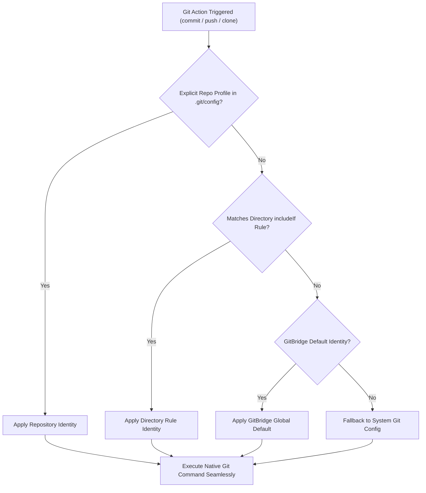

<div align="center">

# 🌉 GitBridge

**Universal Git Identity, Multi-Account & Provider Management Layer**

*Never commit with the wrong email or push with the wrong account again.*

[](https://www.typescriptlang.org/)
[](https://bun.sh/)
[](https://github.com/FuadTesfaye/gitbridge)
[](https://opensource.org/licenses/MIT)
[](./extension)

```
        Developer / Editor (VS Code, Cursor, Antigravity, Terminal)
                                    │
                         (Native git commands)
                                    ▼
                                Native Git
                                    │
        ┌───────────────────────────┼───────────────────────────┐
        │                           │                           │
  [includeIf / .gitconfig]   [credential.helper]          [~/.ssh/config]
        │                           │                           │
        ▼                           ▼                           ▼
  Identity Engine             Secure Keyring              SSH Host Router
(personal vs work email)   (macOS / Linux / Windows)   (github.com-work alias)
```

</div>

---

## 💡 Why GitBridge?

Managing multiple Git identities (Personal, Work, Client, Open-Source) across different providers (GitHub, GitLab, Bitbucket) is frustrating and error-prone:
- ❌ **Accidental commits** signed with your personal email in corporate repos (or vice versa).
- ❌ **SSH Key collisions** when trying to push to multiple GitHub accounts from the same machine.
- ❌ **Plaintext tokens** lingering in insecure config files.
- ❌ **Bloated wrapper scripts** that slow down everyday `git` commands.

### The GitBridge Solution:
- ⚡ **100% Native Git First**: Zero performance overhead. You still run `git commit`, `git push origin main`, and `git pull`. GitBridge seamlessly configures Git's native extension points (`includeIf`, `credential.helper`, `~/.ssh/config Include`).
- 🗂️ **Zero-Friction Directory Routing**: Enter `~/Personal` and Git automatically signs as your personal email. Enter `~/Projects/work` and it automatically switches to your corporate identity and signing key.
- 🔒 **Zero Plaintext Secrets**: OAuth and PAT tokens are stored exclusively in your operating system's hardware-backed secure keyring (**Linux Secret Service**, **macOS Keychain**, or **Windows Credential Manager**).
- 🖥️ **First-Class IDE Extension**: Real-time status bar widget and sidebar explorer for **VS Code**, **Cursor**, **Windsurf**, and **Antigravity IDE**.
- 🚀 **Dual Binaries**: Use `gitbridge` or the ultra-fast `gb` alias everywhere.

---

## ⚡ Installation & Quick Start

### 1. Global Installation
```bash
# Via Bun (recommended)
bun add -g gitbridge

# Or via npm
npm install -g gitbridge
```

### 2. Interactive Onboarding Wizard
Configure your primary identity, secondary work identity, and directory rules in under 60 seconds:
```bash
gb setup
```

### 3. Verify System Health
```bash
gb doc
```

---

## ⌨️ Fast Command Matrix (`gitbridge` / `gb`)

GitBridge exposes both `gitbridge` and `gb` binaries with intuitive short aliases:

| Category | Fast Command | Full Command | Description |
|---|---|---|---|
| **Overview** | `gb st` | `gitbridge status` | Show overall status, active identities, accounts & rules |
| **Context** | `gb ctx` | `gitbridge context` | Show resolved identity & email mismatch alerts for current folder |
| **Switching** | `gb sw [id]` | `gitbridge switch [id]` | Switch active Git identity (for current repo or globally with `-g`) |
| **Init** | `gb init` | `gitbridge init` | Initialize GitBridge profile & pre-commit safety guard for current repo |
| **Identities** | `gb id ls` | `gitbridge identity list` | List all configured commit identities |
| | `gb id add` | `gitbridge identity add` | Create a new Git identity (interactive or with flags) |
| | `gb id use <id>` | `gitbridge identity use <id>` | Set global default Git identity |
| | `gb id rm <id>` | `gitbridge identity remove <id>` | Delete an identity |
| **Accounts** | `gb acc ls` | `gitbridge account list` | List authenticated provider accounts |
| | `gb acc rm <id>` | `gitbridge account remove <id>` | Remove account and securely wipe tokens from OS keyring |
| **Auth** | `gb auth login` | `gitbridge auth login [prov]` | Authenticate with GitHub (Device Flow/PAT), GitLab, or Bitbucket |
| | `gb auth logout` | `gitbridge auth logout <prov>` | Log out and revoke credentials |
| **Rules** | `gb rules ls` | `gitbridge rule list` | List directory routing rules |
| | `gb rule add` | `gitbridge rule add [dir] [id]` | Map a folder path to a Git identity |
| | `gb rule rm <id>` | `gitbridge rule remove <id>` | Remove a directory routing rule |
| **Remotes** | `gb rem ls` | `gitbridge remote list` | List remotes for current repository |
| | `gb rem add` | `gitbridge remote add <n> <u>` | Add remote with optional account SSH routing |
| **Multi-Push** | `gb push --all` | `gitbridge push --all` | Push branch to all configured remotes simultaneously |
| **Integrations**| `gb enable` | `gitbridge enable` | Safely inject GitBridge blocks into `~/.gitconfig` and `~/.ssh/config` |
| | `gb disable` | `gitbridge disable` | Safely remove integrations and restore original configs |
| **Doctor** | `gb doc` | `gitbridge doctor` | Run full diagnostic suite (Git, Keyring, SSH keys, Provider APIs) |

---

## 🖥️ IDE Extension (VS Code, Cursor & Antigravity)

GitBridge includes a built-in extension in [`extension/`](./extension) compatible with **VS Code**, **Cursor**, **Windsurf**, and **Google Antigravity IDE**:

<div align="center">

```
┌────────────────────────────────────────────────────────────────────────────┐
│ Activity Bar  │ GitBridge Explorer                                         │
│ ───────────── │ ────────────────────────────────────────────────────────── │
│ 🌉 GitBridge  │ ▼ ACTIVE CONTEXT                                           │
│               │   📁 Repository: my-awesome-app                            │
│               │   👤 Identity: Fuad Tesfaye <personal@example.com>         │
│               │   🏷️  Source: Directory Rule (~/Personal)                   │
│               │   🐙 Account: @FuadTesfaye (GitHub)                        │
│               │   🔗 Remote: origin (git@github.com:...)                   │
│               │                                                            │
│               │ ▼ IDENTITIES                                           [+] │
│               │   ✔ personal (Fuad Tesfaye <personal@example.com>)         │
│               │   ○ work (Fuad Tesfaye <work@company.com>)                 │
│               │                                                            │
│               │ ▼ ACCOUNTS & PROVIDERS                                 [+] │
│               │   🐙 GitHub: @FuadTesfaye (OAuth Keyring)                  │
│               │   🦊 GitLab: @fuad_corp (PAT)                              │
│               │                                                            │
│               │ ▼ DIRECTORY RULES                                      [+] │
│               │   📁 ~/Personal ➔ personal                                 │
│               │   📁 ~/Projects/work ➔ work                                │
└────────────────────────────────────────────────────────────────────────────┘
┌────────────────────────────────────────────────────────────────────────────┐
│ Status Bar: [$(person) personal: Fuad Tesfaye] [$(github) @FuadTesfaye]    │
└────────────────────────────────────────────────────────────────────────────┘
```

</div>

### Extension Highlights:
- 👤 **Live Status Bar Widget**: Shows active identity badge and provider account at all times.
- 🔄 **Real-Time State Watcher**: Run `gb sw work` in your terminal and the IDE status bar and explorer update instantly without an editor reload.
- ⚠️ **Mismatch Warning**: Highlights mismatched `.git/config` emails before you commit.
- 🚀 **One-Click Multi-Push**: Trigger parallel pushes directly from the sidebar.

---

## 🔒 Security Model & Local-Only Architecture

GitBridge is engineered with a **zero-trust, local-only security architecture**:

- 🛡️ **100% Local Execution**: GitBridge operates exclusively on your local machine. It has **no telemetry, no tracking, and no external cloud servers**. Requests are made only directly to the Git providers you configure (GitHub, GitLab, Bitbucket).
- 🔑 **Hardware-Backed OS Keychains**: Access tokens and passwords are **never written to plain JSON files, logs, or git config files**. They are stored directly in your operating system's native secure keyring:
  - **Linux**: Linux Secret Service (`secret-tool` / libsecret / DBus Session Keyring).
  - **macOS**: Apple Keychain Services (`/usr/bin/security` backed by Secure Enclave).
  - **Windows**: Windows Credential Manager (DPAPI-encrypted).
- 🔐 **Air-Gapped / Headless Fallback**: In environments without a graphical keychain daemon (e.g. CI containers), credentials are encrypted in `~/.gitbridge/vault.enc` using **AES-256-GCM** with a **PBKDF2** machine-unique derivation key (100,000 rounds of SHA-256 with cryptographically random salt and 12-byte IV).
- 📁 **Restricted POSIX Permissions**: All configuration and generated files enforce strict permission modes:
  - `~/.gitbridge/` directory: `0700` (`rwx------`, owner only)
  - Config, key & vault files: `0600` (`rw-------`, owner only)
- 🗝️ **SSH Key Isolation**: Dedicated `Host <host>-<account_id>` blocks enforce `IdentitiesOnly yes`, ensuring the SSH agent only presents the specific key mapped to that account—preventing cross-account identity leaks.

---

## 🏗️ Identity Resolution Precedence

When Git or GitBridge resolves an identity for any directory:

$$\text{Local Repository Profile} \succ \text{Directory Rule (includeIf)} \succ \text{Global Default Identity} \succ \text{System Git Config}$$



---

## 🧪 Testing & Verification

GitBridge is verified with a comprehensive automated test suite covering unit schemas, credential stores, injectors, URL parsers, and full Git lifecycle integrations:

```bash
# Run all unit & integration tests
bun test

# Run strict TypeScript typechecks
bun run typecheck
```

---

## 📄 License

MIT © [Fuad Tesfaye](https://github.com/FuadTesfaye)
